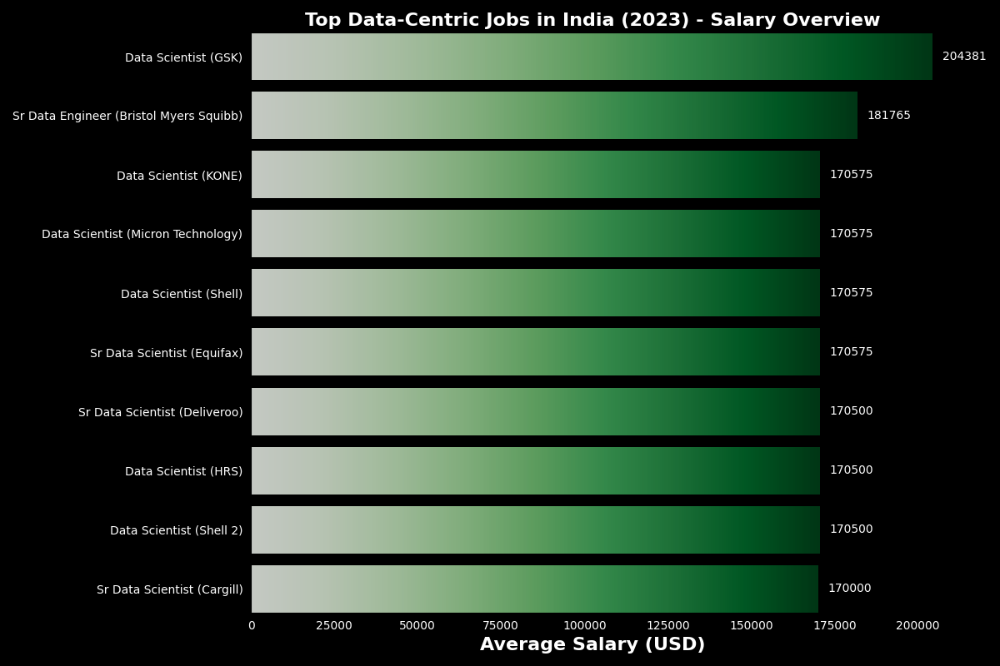

# Introduction
📊 Dive into the data job market! Focusing on data-Centric roles in India, this project explores 💰 top-paying jobs, 🔥 in-demand skills, and 📈 where high demand meets high salary in data analytics.

🔍 SQL queries? Check them out here: [project_sql folder](/SQL_CODES/Git/projects/)

# Background
Driven by a quest to navigate the data-Centric job market more effectively, this project was born from a desire to pinpoint top-paid and in-demand skills, streamlining others work to find optimal jobs.


### The questions I wanted to answer through my SQL queries were:
#### *Adding to that question, I am going to focus more on the Indian location and top & well-known data-centric roles (data analyst, data engineer, data scientist, and business analyst).*

1. What are the top-paying data-centric jobs in India?
2. What skills are required for the top-paying data-centric jobs in India?
3. What are the most in-demand skills for data-centric roles in India?
4. What are the top skills based on the salary in India?
5. What are the most optimal skills to learn in India? 

# Tools I Used
For my deep dive into the data-centric job market, I harnessed the power of several key tools:

- **SQL:** The backbone of my analysis, allowing me to query the database and unearth critical insights.
- **PostgreSQL:** The chosen database management system, ideal for handling the job posting data.
- **Visual Studio Code:** My go-to for database management and executing SQL queries.
- **Git & GitHub:** Essential for version control and sharing my SQL scripts and analysis, ensuring collaboration and project tracking.

# The Analysis
Each query for this project aimed at investigating specific aspects of the data-centric job market. Here’s how I approached each question:

### 1. Top Paying data-centric Jobs
To identify the highest-paying roles, I filtered top data-centric positions (data analyst, data engineer, data scientist, and business analyst) by average yearly salary, focusing location on India. This query highlights the high paying opportunities in the field.

```sql
SELECT 
    j.job_title_short,
    c.name AS company_name,
    c.link_google,
    j.job_location,
    j.job_work_from_home,
    j.job_posted_date,
    j.job_schedule_type,
    j.salary_year_avg
FROM 
  job_postings_fact AS j
LEFT JOIN company_dim AS c ON j.company_id = c.company_id
WHERE j.salary_year_avg IS NOT NULL  
  AND j.job_location = 'India' 
  AND (
      j.job_title_short LIKE '%Data%' 
      OR
      j.job_title_short LIKE '%Business%'
      )
ORDER BY 
  j.salary_year_avg DESC
LIMIT 10; 

```

 *For this whole project, I am using the **LIKE** operator for filtration. which is working fine with my database.
But the proper way to write it was to use the **in** operator.*
```sql
where j.job_title_short in ('data analyst', 'data engineer', 'data scientist', 'business analyst') 
```

Here's the breakdown of the top data-centric Indian jobs in 2023:
 - **Wide Salary Range:**  Top 10 high paying data-centric roles span from $170,000 to $204,000, indicating significant salary potential in the field.
- **Diverse Employers:**  Companies like GSK, Bristol Myers Squibb, shell, and KONE are among those offering high salaries, showing a broad interest across different industries.
- **Posting Dates:** The jobs were posted between October and December 2023, showing a healthy recruitment drive during the latter part of the year.
- These roles are **full-time** and based in India, with **no remote work** options listed.


*Bar graph visualizing the salary for the top 10 data_centric Jobs in India.*

### 2. Skills for Top Paying Jobs
To understand what skills are required for the top-paying jobs in India, I joined the job postings with the skills data, providing insights into what employers value for high-compensation roles.
```sql
WITH top_paying_jobs AS (
    SELECT 
        j.job_id,
        j.job_title_short,
        c.name AS company_name,
        j.salary_year_avg
    FROM 
      job_postings_fact AS j
    LEFT JOIN company_dim AS c ON j.company_id = c.company_id
    WHERE j.salary_year_avg IS NOT NULL 
      AND j.job_location = 'India'
      AND (
          j.job_title_short LIKE '%Data%' OR
          j.job_title_short LIKE '%Business%'
          )
    ORDER BY 
      j.salary_year_avg DESC
    LIMIT 10
)

-- Query to select skills for the top-paying jobs

SELECT  
    top.job_title_short,
    top.company_name,
    sd.skills,
    top.salary_year_avg
FROM 
  top_paying_jobs AS top
INNER JOIN skills_job_dim AS sj ON top.job_id = sj.job_id
INNER JOIN skills_dim AS sd ON sj.skill_id = sd.skill_id
ORDER BY 
    top.salary_year_avg DESC;

```
Here's the breakdown of the most demanded skills for data analysts in 2023, based on job postings:
- Top-paying roles like **Senior Data Engineer** at **Bristol Myers Squibb** offer ₹181,765 annually, valuing skills such as **Python**, **AWS**, and **Tableau**.
- **Data Scientist** positions at companies like **Micron and Shell**, with salaries around ₹170,575, prioritize skills like **SQL**, **Python**, and **Snowflake**.
- Overall, **SQL**, **Python**, and **AWS** emerge as key skills for high-paying data roles in India.

| Job Title            | Company Name            | Skills        |  Average Salary (Year) |
|:---------------------|:-------------------------|---------------:|-----------------------:|
| Senior Data Engineer | Bristol Myers Squibb    | python        | $181,765              |
| Senior Data Engineer | Bristol Myers Squibb    | aws           | $181,765              |
| Senior Data Engineer | Bristol Myers Squibb    | excel         | $181,765              |
| Senior Data Engineer | Bristol Myers Squibb    | tableau       | $181,765              |
| Data Scientist       | Shell                   | shell         | $170,575              |
| Data Scientist       | Shell                   | databricks    | $170,575              |
| Data Scientist       | Micron Technology       | sql           | $170,575              |
| Data Scientist       | Micron Technology       | python        | $170,575              |
| Data Scientist       | Micron Technology       | snowflake     | $170,575              |
| Data Scientist       | Micron Technology       | spark         | $170,575              |

*Table of top 10 High paying skills in India*

### 3. In-Demand Skills for Data Analysts

This query helped identify the skills most frequently requested in job postings, directing focus to areas with high demand.

```sql
SELECT 
    skills,
    COUNT(skills_job_dim.job_id) AS demand_count
FROM job_postings_fact j
INNER JOIN skills_job_dim ON j.job_id = skills_job_dim.job_id
INNER JOIN skills_dim ON skills_job_dim.skill_id = skills_dim.skill_id
WHERE
    j.job_location = 'India' AND
    (
    j.job_title_short LIKE '%Data%' OR
    j.job_title_short LIKE '%Business%'
    )
GROUP BY
    skills
ORDER BY
    demand_count DESC
LIMIT 5;
```
Here's the breakdown of the most demanded skills for Data Centric Indian Jobs in 2023
- The most in-demand skills for data-Centric roles in India are **SQL** and **Python**.
- Other essential skills include **Excel**, **Tableau** and **AWS** reflecting a high demand for both programming and data analysis tools.
- Additionally, cloud technologies like **AWS** and **Azure** show growing importance in the industry.

| Skills     | Demand_Count   |
|------------|---------------:|
| SQL        | 3854           |
| python     | 3517           |
| Excel      | 1470           |
| Tableau    | 1445           |
| AWS        | 1401           |

*Table of the demand for the top 5 skills in data-centric job postings in India*

### 4. Skills Based on Salary
Exploring the average salaries associated with different skills revealed which skills are the highest paying.
```sql
SELECT 
    sd.skills as skill_name,
    round(avg(j.salary_year_avg)) as Avg_salary_year
from 
    skills_job_dim sj
inner JOIN job_postings_fact j on j.job_id = sj.job_id
inner JOIN  skills_dim sd on sj.skill_id = sd.skill_id
WHERE j.salary_year_avg IS NOT NULL 
      AND j.job_location = 'India'
      AND (
          j.job_title_short LIKE '%Data%' OR
          j.job_title_short LIKE '%Business%'
          )
group by 
    skill_name
ORDER BY 
    Avg_salary_year desc
limit 20
```

Here's a breakdown of the results for top paying skills for Data Centric Jobs in India:

- **High-Paying Data Skills:** **C++** and **Go** are high-paying skills in the data-centric domain, with an average salary of $170,500, indicating demand for data engineers and scientists skilled in these efficient, low-level programming languages.
- **Data Science and ML Tools:** Skills like **Keras** (avg. salary $164,460) and **NLTK** (avg. salary $157,500) show the growing demand for expertise in machine learning (ML) and natural language processing (NLP) frameworks within data science roles.
- **Data Engineering & BI Tools:** Skills such as **DAX**, **Selenium**, and **SSIS**, averaging around $156,500 to $150,942 annually, are essential in data engineering and business intelligence, reflecting the need for data manipulation, automation, and integration tools.


| Skill Name   | Average Salary (Year) |
|--------------|-----------------------|
| c++          | $170,500              |
| go           | $170,500              |
| keras        | $164,460              |
| express      | $158,250              |
| nltk         | $157,500              |
| gitlab       | $157,500              |
| bash         | $157,500              |
| dax          | $156,500              |
| javascript   | $156,500              |
| c#           | $156,500              |

*Table of the average salary for the top 10 paying skills for data analysts*

### 5. Most Optimal Skills to Learn

Combining insights from demand and salary data using **CTE**, this query aimed to pinpoint skills that are both in high demand and have high salaries, offering a strategic focus for skill development.

```sql
WITH Demanded_skills as (
    SELECT 
        sd.skill_id as skill_id,
        sd.skills as skill_name,
        count(*) as job_count 
    from 
        skills_job_dim sj
    inner JOIN job_postings_fact jo on jo.job_id = sj.job_id
    inner JOIN  skills_dim sd on sj.skill_id = sd.skill_id
    WHERE 
        jo.job_location = 'India'
        AND (
            jo.job_title_short LIKE '%Data%' OR
            jo.job_title_short LIKE '%Business%'
            )
    group by sd.skill_id
    ORDER BY job_count desc
    limit 10
),

salary as (
    select 
        sd.skill_id as skills_id,
        sd.Skills as skill,
        round(avg(jo.salary_year_avg)) as Avg_salary_year
    from 
        skills_job_dim sj
    inner JOIN job_postings_fact jo on jo.job_id = sj.job_id
    inner JOIN  skills_dim sd on sj.skill_id = sd.skill_id
    where
        jo.job_title_short like '%Data%' and jo.salary_year_avg is not NULL
    group by 
        skills_id
)

select 
    ds.skill_id,
    ds.skill_name,
    ds.job_count,
    sa.Avg_salary_year as avgs
from 
    Demanded_skills ds
inner JOIN salary sa on ds.skill_id = sa.skills_id
order BY 
    ds.job_count DESC, sa.Avg_salary_year DESC
LIMIT 10

```

| Skill ID | Skill Name   | Job Count | Average Salary (Year) |
|----------|--------------|-----------|-----------------------|
| 0        | sql          | 3854      | $125,844              |
| 1        | python       | 3517      | $133,137              |
| 181      | excel        | 1470      | $100,124              |
| 182      | tableau      | 1445      | $117,769              |
| 76       | aws          | 1401      | $137,478              |
| 92       | spark        | 1322      | $142,458              |
| 74       | azure        | 1294      | $131,486              |
| 5        | r            | 1081      | $127,585              |
| 183      | power bi     | 1008      | $107,897              |
| 97       | hadoop       | 824       | $138,875              |


*Table of the most optimal skills for data-centric role sorted by salary*

- **High-Demand Programming Languages:** SQL and Python are the most in-demand skills, with job counts of 3,854 and 3,517 respectively, reflecting their strong presence across various industries.
- **Top-Paying Big Data Skill:** Spark offers the highest average salary at $142,458, indicating the premium for expertise in big data technologies.
- **Cloud Dominance:** Cloud-related skills like AWS and Azure are highly sought after, with strong job demand and average salaries exceeding $130,000, showcasing the growing importance of cloud infrastructure.
- **Business Intelligence Tools:** Tools like Excel and Power BI, despite lower salaries, are still highly in demand, especially for roles focused on data analysis and business intelligence.

# What I Learned

Throughout this adventure, I've turbocharged my SQL toolkit with some serious firepower:

🧩 **SQL Setup Mastery:** Acquired the skills to set up VS Code, PostgreSQL, and pgAdmin like a pro, creating a robust environment for efficient SQL development 🚀.

💡 **SQL Query Crafting:** Learned to write clear and effective SQL queries, from basic SELECT statements to complex multi-table joins and subqueries, building a strong foundation for database querying 📋.

🔧 **Advanced SQL Techniques:** Mastered advanced SQL skills, including merging tables and using WITH clauses for creating temporary tables, Subqueries, turning complex queries into a smooth operation 🧙‍♂️.

📊 **Data Analysis Skills:** Got hands-on with job posting data, learning how to filter, group, and sort information to uncover insights like average salaries and job locations, all while improving my proficiency with SQL functions 🏆.

🚀 **Project Application:** Successfully completed 5 SQL Queries using job posting data from 2023, analyzing key factors such as job title, average salary, Job counts. These project helped solidify my ability to turn raw data into actionable insights that reflect real-world scenarios 🌍.

# Conclusions

### Insights
From the analysis, several general insights emerged:

- **Highest-Paying Data Jobs:** The top-paying data-centric roles in India offer impressive salaries, with the best positions reaching up to $204,000, showing the strong earning potential in the field 💵.

- **Skills for High Salaries:** Top-paying roles need strong skills in SQL and Python, making these skills essential for getting high salaries in data jobs 📈.

- **Most In-Demand Skills:** SQL and Python are the most requested skills in the job market for data roles, so they are crucial for job seekers wanting to land good positions 🔍.

- **Specialized Skill Value:** Skills in areas like C++, Go, and Spark are linked to higher average salaries, showing that expertise in these specialized areas is valued and well-paid 🛠️.

- **Best Skills for Market Value:** SQL leads in demand and offers high average salaries, making it one of the best skills to learn for increasing job market value and advancing in the data profession 🚀.

### Closing Thoughts

The SQL course provided a comprehensive foundation in database management and query crafting, from setting up VS Code, PostgreSQL, and pgAdmin, to mastering advanced SQL techniques. The hands-on projects, including crafting 5 SQL queries with real-world job posting data from 2023, allowed for practical application of these skills, revealing insights into high-paying and in-demand data roles. The course not only enhanced my technical abilities but also deepened my understanding of industry trends, highlighting the importance of skills like SQL and Python in the job market. Overall, this learning experience has equipped me with the knowledge and confidence to tackle complex data challenges and pursue opportunities in the evolving field of data analysis.